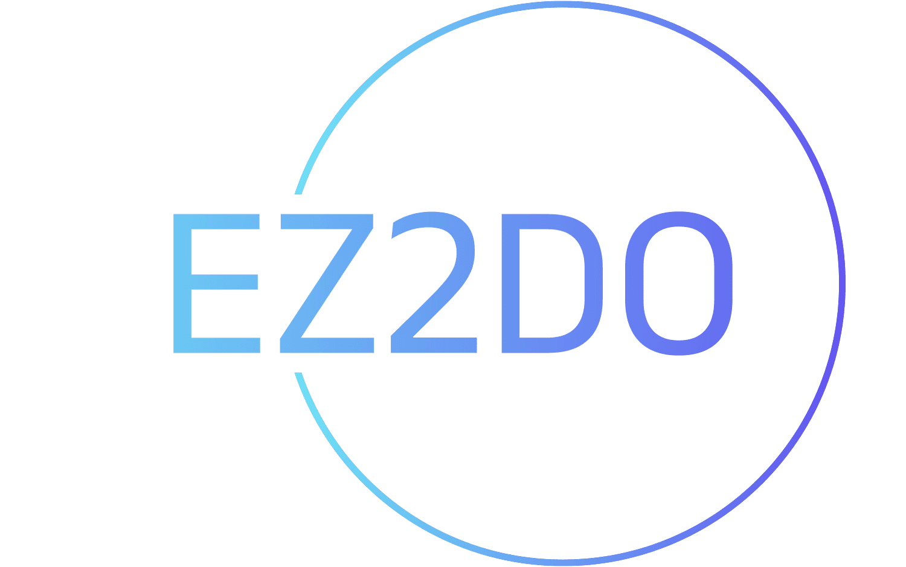

<!-- Improved compatibility of back to top link: See: https://github.com/othneildrew/Best-README-Template/pull/73 -->

<a id="readme-top"></a>

<!--
*** Thanks for checking out the Best-README-Template. If you have a suggestion
*** that would make this better, please fork the repo and create a pull request
*** or simply open an issue with the tag "enhancement".
*** Don't forget to give the project a star!
*** Thanks again! Now go create something AMAZING! :D
-->

<!-- PROJECT SHIELDS -->
<!--
*** I'm using markdown "reference style" links for readability.
*** Reference links are enclosed in brackets [ ] instead of parentheses ( ).
*** See the bottom of this document for the declaration of the reference variables
*** for contributors-url, forks-url, etc. This is an optional, concise syntax you may use.
*** https://www.markdownguide.org/basic-syntax/#reference-style-links
-->

[![Contributors][contributors-shield]][contributors-url]
[![Forks][forks-shield]][forks-url]
[![Stargazers][stars-shield]][stars-url]
[![Issues][issues-shield]][issues-url]
[![MIT License][license-shield]][license-url]
[![LinkedIn][linkedin-shield]][linkedin-url]

<!-- PROJECT LOGO -->
<br />
<div align="center">
  <a href="https://github.com/cipriann122/final-project-todo-app">
    
  </a>

<h3 align="center">EZ2DO App</h3>

  <p align="center">
    This is a Vue.js-based ToDo application that utilizes Pinia for state management and Vue Router for navigation. The application allows users to manage their tasks, including adding new tasks, viewing all tasks, marking tasks as completed, and deleting tasks. Users can also register and log in to the application which uses Supabase's API for user authentication and management.
    <br />
    <a href="https://github.com/cipriann122/final-project-todo-app"><strong>Explore the docs »</strong></a>
    <br />
    <br />
    <a href="https://final-project-todo-app.netlify.app/">View Demo</a>
    ·
    <a href="https://github.com/cipriann122/final-project-todo-app/issues/new?labels=bug&template=bug-report---.md">Report Bug</a>
    ·
    <a href="https://github.com/cipriann122/final-project-todo-app/issues/new?labels=enhancement&template=feature-request---.md">Request Feature</a>
  </p>
</div>

<!-- TABLE OF CONTENTS -->
<details>
  <summary>Table of Contents</summary>
  <ol>
    <li>
      <a href="#about-the-project">About The Project</a>
      <ul>
        <li><a href="#built-with">Built With</a></li>
      </ul>
    </li>
    <li>
      <a href="#getting-started">Getting Started</a>
      <ul>
        <li><a href="#prerequisites">Prerequisites</a></li>
        <li><a href="#installation">Installation</a></li>
      </ul>
    </li>
    <li><a href="#usage">Usage</a></li>
    <li><a href="#roadmap">Roadmap</a></li>
    <li><a href="#contributing">Contributing</a></li>
    <li><a href="#contact">Contact</a></li>
    <li><a href="#acknowledgments">Acknowledgments</a></li>
  </ol>
</details>

<!-- ABOUT THE PROJECT -->

## About The Project

[![Product Name Screen Shot][product-screenshot]](https://example.com)

<p align="right">(<a href="#readme-top">back to top</a>)</p>

### Built With

- [![Vue][Vue.js]][Vue-url]

<p align="right">(<a href="#readme-top">back to top</a>)</p>

<!-- GETTING STARTED -->

## Getting Started

To get a local copy up and running follow these simple example steps.

### Prerequisites

Before you begin, ensure you have Node.js and the npm package manager installed

- npm
  ```sh
  npm install npm@latest -g
  ```

### Installation

1. Clone the repo
   ```sh
   git clone https://github.com/cipriann122/final-project-todo-app.git
   cd final-project-todo-app
   ```
2. Install NPM packages
   ```sh
   npm install
   ```

## Running the application

- To start the development server, run:

  ```sh
  npm run dev
  # or
  yarn dev
  ```

<p align="right">(<a href="#readme-top">back to top</a>)</p>

<!-- USAGE EXAMPLES -->

## Usage

- Task Organization: Create, edit, and manage your tasks
  with ease. Our app allows you to categorize tasks by priority, set
  deadlines, and add detailed notes to keep all necessary information at
  your fingertips.

- Account Management: Effortlessly manage your account
  settings, update personal information, and secure your data with our
  robust authentication features.

- Responsive Design: Enjoy a seamless experience on any
  device. EZ2DO is optimized for both desktop and mobile devices, allowing
  you to access your tasks whenever and wherever you need.

- Secure and Reliable: Built with cutting-edge security
  measures, EZ2DO ensures that your data is protected and your privacy is
  maintained.

<p align="right">(<a href="#readme-top">back to top</a>)</p>

<!-- ROADMAP -->

## Roadmap

- [ ] Updated design
- [ ] Priority tasks
- [ ] Better performance
  - [ ] Faster load times

See the [open issues](https://github.com/cipriann122/final-project-todo-app/issues) for a full list of proposed features (and known issues).

<p align="right">(<a href="#readme-top">back to top</a>)</p>

<!-- CONTRIBUTING -->

## Contributing

Contributions are what make the open source community such an amazing place to learn, inspire, and create. Any contributions you make are **greatly appreciated**.

If you have a suggestion that would make this better, please fork the repo and create a pull request. You can also simply open an issue with the tag "enhancement".
Don't forget to give the project a star! Thanks again!

1. Fork the Project
2. Create your Feature Branch (`git checkout -b feature/AmazingFeature`)
3. Commit your Changes (`git commit -m 'Add some AmazingFeature'`)
4. Push to the Branch (`git push origin feature/AmazingFeature`)
5. Open a Pull Request

<p align="right">(<a href="#readme-top">back to top</a>)</p>

<!-- CONTACT -->

## Contact

Ciprian Gombar - [@cipriann122](https://twitter.com/cipriann122)

Project Link: [https://github.com/cipriann122/final-project-todo-app](https://github.com/cipriann122/final-project-todo-app)

<p align="right">(<a href="#readme-top">back to top</a>)</p>

<!-- ACKNOWLEDGMENTS -->

## Acknowledgments

- []()
- []()
- []()

<p align="right">(<a href="#readme-top">back to top</a>)</p>

<!-- MARKDOWN LINKS & IMAGES -->
<!-- https://www.markdownguide.org/basic-syntax/#reference-style-links -->

[contributors-shield]: https://img.shields.io/github/contributors/cipriann122/final-project-todo-app.svg?style=for-the-badge
[contributors-url]: https://github.com/cipriann122/final-project-todo-app/graphs/contributors
[forks-shield]: https://img.shields.io/github/forks/cipriann122/final-project-todo-app.svg?style=for-the-badge
[forks-url]: https://github.com/cipriann122/final-project-todo-app/network/members
[stars-shield]: https://img.shields.io/github/stars/cipriann122/final-project-todo-app.svg?style=for-the-badge
[stars-url]: https://github.com/cipriann122/final-project-todo-app/stargazers
[issues-shield]: https://img.shields.io/github/issues/cipriann122/final-project-todo-app.svg?style=for-the-badge
[issues-url]: https://github.com/cipriann122/final-project-todo-app/issues
[license-shield]: https://img.shields.io/github/license/cipriann122/final-project-todo-app.svg?style=for-the-badge
[license-url]: https://github.com/cipriann122/final-project-todo-app/blob/master/LICENSE.txt
[linkedin-shield]: https://img.shields.io/badge/-LinkedIn-black.svg?style=for-the-badge&logo=linkedin&colorB=555
[linkedin-url]: https://linkedin.com/in/cipriangombar
[product-screenshot]: src/assets/img/screenshot.png
[Next.js]: https://img.shields.io/badge/next.js-000000?style=for-the-badge&logo=nextdotjs&logoColor=white
[Next-url]: https://nextjs.org/
[React.js]: https://img.shields.io/badge/React-20232A?style=for-the-badge&logo=react&logoColor=61DAFB
[React-url]: https://reactjs.org/
[Vue.js]: https://img.shields.io/badge/Vue.js-35495E?style=for-the-badge&logo=vuedotjs&logoColor=4FC08D
[Vue-url]: https://vuejs.org/
[Angular.io]: https://img.shields.io/badge/Angular-DD0031?style=for-the-badge&logo=angular&logoColor=white
[Angular-url]: https://angular.io/
[Svelte.dev]: https://img.shields.io/badge/Svelte-4A4A55?style=for-the-badge&logo=svelte&logoColor=FF3E00
[Svelte-url]: https://svelte.dev/
[Laravel.com]: https://img.shields.io/badge/Laravel-FF2D20?style=for-the-badge&logo=laravel&logoColor=white
[Laravel-url]: https://laravel.com
[Bootstrap.com]: https://img.shields.io/badge/Bootstrap-563D7C?style=for-the-badge&logo=bootstrap&logoColor=white
[Bootstrap-url]: https://getbootstrap.com
[JQuery.com]: https://img.shields.io/badge/jQuery-0769AD?style=for-the-badge&logo=jquery&logoColor=white
[JQuery-url]: https://jquery.com
